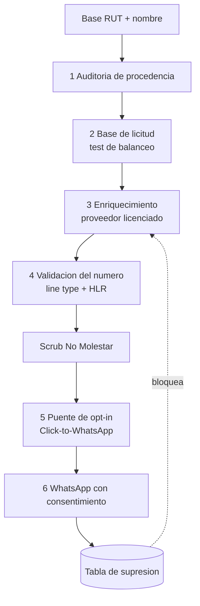
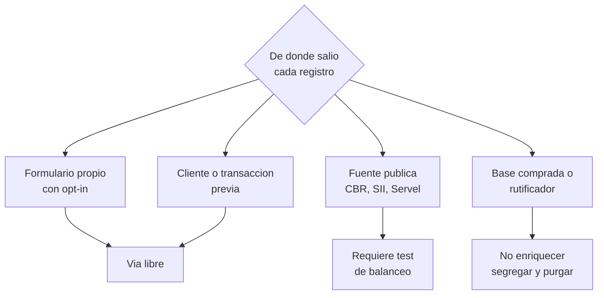
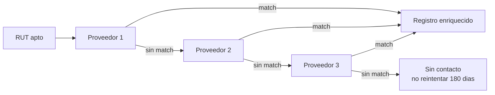

# De RUT a WhatsApp: playbook de enriquecimiento de contacto en Chile

**Documento de trabajo interno — no publicar.** Versión viva en Claude Docs: https://claude.ai/code/artifact/c633aaf0-0067-4da3-a91d-a39f4b230c2c

As-of: 2026-09-16

## Resumen ejecutivo

Se puede hacer, y el camino limpio existe. Pero el cuello de botella no es conseguir el teléfono: es conseguir el permiso para escribirlo. El dato se compra en dos semanas; el permiso se construye, y ahí se gana o se pierde el proyecto.

La buena noticia: hay una jugada que resuelve el permiso sin pedirlo. Convertir la lista fría en tráfico entrante. En vez de escribirle a la gente, hacés que la gente te escriba a vos.

### El problema real, en una línea

Meta prohíbe que una empresa inicie conversación por WhatsApp sin opt-in previo de ese número. No es zona gris ni algo que se negocie con el proveedor. Si mandás plantillas a una lista fría, el ratio de bloqueos sube, la calidad del número cae de verde a amarillo a rojo, y en rojo dejás de poder enviar marketing. Con volumen suficiente el número queda baneado de forma permanente. Comprar mejor data no arregla esto: lo acelera.

### La jugada central: Click-to-WhatsApp

La salida es no iniciar nunca la conversación. Cuatro pasos:

1. **Enriquecés** el RUT contra un proveedor licenciado y obtenés el móvil.
2. **Hasheás** ese teléfono y lo subís a Meta como Custom Audience. El hash es de una vía: Meta matchea contra sus usuarios y vos nunca exponés la lista.
3. **Corrés anuncios Click-to-WhatsApp** contra esa audiencia: una tasación, una guía de precios por comuna, una oportunidad concreta.
4. **El que hace clic abre la conversación él mismo.** Eso es *user-initiated*: no requiere opt-in, no consume plantilla, y abre una ventana de 24 horas de texto libre.

Dentro de esa ventana pedís el opt-in explícito para contacto futuro. A partir de ahí ese número es tuyo, con consentimiento documentado, y le podés escribir cuando quieras.

El costo de esta jugada no es el dato: es la pauta publicitaria. Pero compra algo que ningún proveedor vende, que es permiso válido.

### El embudo, con números

Sobre una base de 100.000 RUT con nombre. Los porcentajes son estimaciones de diseño, a calibrar con una prueba de 5.000 registros antes de comprometer volumen.

| Etapa | Tasa | Quedan | Por qué se pierde |
| --- | --- | --- | --- |
| Base inicial con RUT + nombre | 100% | 100.000 |  |
| Depuración y normalización | 92% | 92.000 | RUT inválido, duplicados, fallecidos |
| Match con proveedor de contactabilidad | 55% | 50.600 | El proveedor no tiene ese RUT |
| Número móvil válido (line type) | 85% | 43.000 | Fijos, VoIP, números dados de baja |
| Scrub contra Registro No Molestar | 88% | 37.800 | Inscritos en SERNAC: contacto prohibido |
| Alcanzables en Meta (match de audiencia) | 65% | 24.600 | El número no corresponde a una cuenta Meta |
| Clic en anuncio Click-to-WhatsApp | 3% | 740 | Costo de pauta, no de data |
| Opt-in explícito en conversación | 60% | 440 |  |

Unos **440 contactos con permiso real por cada 100.000 RUT, por ciclo de campaña**. Suena poco hasta que lo comparás con el ratio de una lista fría quemada, que es cero más un número baneado. Y la audiencia de 24.600 no se consume: se le vuelve a pautar cada mes.

### Lo que cambia el 1 de diciembre de 2026

Faltan diez semanas. La Ley 21.719 entra en vigencia plena y trae tres exigencias que hay que tener construidas **antes**, no después:

- **Base de licitud documentada** para el enriquecimiento, con test de balanceo por escrito. El interés legítimo sirve, pero no es cheque en blanco y el estándar es más duro cuando el fin es comercial.
- **Deber de informar** del artículo 14: cuando los datos no los obtuviste del titular, tenés que poder acreditar la licitud del tratamiento frente a él.
- **Derecho de oposición** al marketing directo, artículo 8 letra b: supresión persistente y demostrable, no un borrado manual del CRM.

Multas hasta 20.000 UTM, cerca de 1.400 millones de pesos, y hasta 4% de ingresos anuales en reincidencia.

### Los tres proveedores a llamar

Ninguno publica precio: todos son contrato B2B con declaración de finalidad.

| Proveedor | Por qué | Qué pedirle |
| --- | --- | --- |
| [TuSI SpA](https://bigdata.tusi.cl/index.php/portfolio-item/contactabilidad-correos-y-telefonos-certificados-relacionados-a-un-rut-bigdatav3/) | Único que describe exactamente RUT a móvil y mail | Origen por campo y DPA adaptado a 21.719 |
| [Datamart SpA](https://docs.datamart.cl/) | Mejor arquitectura: GraphQL + webhooks | Match rate real sobre una muestra tuya |
| [Equifax Chile](https://developer.latam.equifax.com/documentation) | Mayor cobertura del país | Si habilitan finalidad inmobiliaria |

La pregunta que los ordena mejor que cualquier demo: **de qué fuente sale el móvil y con qué base de licitud fue cedido**. Si la respuesta es vaga, la respuesta real es filtración, y esa data te contamina la base entera.

### Lo que hay que decidir primero

Antes de firmar con nadie hay que auditar de dónde salió la base actual. Si vino de una fuente con consentimiento, el proyecto es directo. Si vino de un rutificador, una base comprada o un scrape, el enriquecimiento hereda ese vicio y lo amplifica: estarías construyendo sobre un pasivo. Esa auditoría es la Etapa 1 y es la única que no se puede saltar.

### Los tres plazos

| Semanas | Qué | Resultado |
| --- | --- | --- |
| 1 a 3 | Auditoría de procedencia + test de balanceo + alta de BSP | Base legal lista |
| 4 a 6 | Prueba de enriquecimiento con 5.000 registros en 2 proveedores | Match rate y costo reales |
| 7 a 10 | Primera campaña Click-to-WhatsApp + medición | Embudo calibrado con datos propios |

## La premisa a corregir

Tener el RUT y el nombre en tu base **no es** una base de licitud. Es un hecho, no un permiso. Bajo la Ley 21.719 la licitud no se predica del dato sino del **tratamiento**: cada finalidad nueva necesita su propia justificación, aunque el dato esté en tu servidor desde hace años.

Esto cambia la pregunta. No es «¿puedo usar lo que tengo?» sino «¿para qué lo voy a usar, y con qué base de licitud para *ese* uso?».

### Por qué el enriquecimiento es un tratamiento nuevo

Agregar un teléfono desde un tercero no es «completar» un registro existente. Legalmente es una **cesión de datos desde un tercero hacia vos**, y dispara tres obligaciones que la base original no tenía:

1. **Base de licitud propia** para la operación de enriquecimiento, distinta de la que ampara tener el RUT.
2. **Deber de informar** — artículo 14. Cuando los datos no los obtuviste del titular, tenés que poder acreditarle la licitud del tratamiento. No podés invocar que «ya estaban».
3. **Responsabilidad sobre el origen del dato cedido.** Si el proveedor te cede un móvil de origen ilícito, el tratamiento ilícito pasa a ser también tuyo. La buena fe no es defensa sin due diligence.

Hay un cuarto efecto, más sutil y más caro. La propia ley establece que cuando combinás o complementás datos de fuentes de acceso público con otros datos, **el resultado queda cubierto por el deber de secreto o confidencialidad**. El registro enriquecido tiene un régimen más estricto que sus partes por separado. Enriquecer no diluye la obligación: la concentra.

### Las tres preguntas que reemplazan a la premisa

| Pregunta | Por qué decide el proyecto |
| --- | --- |
| ¿De dónde salió la base actual? | Si el origen está viciado, todo lo que construyas encima hereda el vicio |
| ¿Cuál es la finalidad declarada? | Define qué base de licitud podés invocar y qué proveedor te va a habilitar |
| ¿Cómo apago el tratamiento para una persona? | El derecho de oposición exige supresión persistente y demostrable |

La tercera es la que más se subestima. No alcanza con sacar a alguien de una lista: si el RUT vuelve a entrar en el próximo ciclo de enriquecimiento, volviste a tratarlo. La supresión tiene que vivir en una tabla que el pipeline consulta **antes** de enriquecer, no después.

### Lo que sí te da tener el RUT

No todo es restricción. Tener RUT y nombre verificados te da dos cosas valiosas:

- **Capacidad de deduplicar y de auditar.** El RUT es una llave única y estable. Te permite demostrar exactamente a quién trataste, cuándo y por qué, que es justamente lo que una fiscalización va a pedir.
- **Capacidad de honrar la oposición de verdad.** Sin una llave única, el «no me contactes más» es imposible de garantizar. Con RUT, es una fila en una tabla de supresión.

Dicho de otro modo: el RUT no es tu permiso para contactar, pero sí es tu mejor herramienta para demostrar que contactás bien.

## Los tres muros

El proyecto no enfrenta un obstáculo sino tres, y son independientes entre sí. Cumplir uno no te exime de los otros dos. El error típico es resolver el legal y morir en el de Meta, que es el que actúa más rápido y sin aviso.

| Muro | Quién lo aplica | Velocidad de la sanción | Consecuencia |
| --- | --- | --- | --- |
| Ley 21.719 | Agencia de Protección de Datos | Meses, tras denuncia | Hasta 20.000 UTM |
| Política de Meta | Automática, algorítmica | Días | Baneo permanente del número |
| No Molestar / SERNAC | SERNAC y Subtel | Semanas | Multa e infracción al consumidor |

### Muro 1 — Ley 21.719

Vigencia plena el **1 de diciembre de 2026**. Publicada el 13 de diciembre de 2024, con 24 meses de vacancia. Reemplaza a la Ley 19.628 y crea la Agencia de Protección de Datos Personales con facultades de fiscalización y sanción.

Lo que exige para este proyecto, en concreto:

- **Base de licitud por finalidad.** El interés legítimo sirve, pero requiere un test de balanceo documentado, y el estándar es más exigente cuando el fin es comercial que cuando es de interés público.
- **Deber de informar** cuando los datos no se obtuvieron del titular (art. 14).
- **Derecho de oposición al marketing directo** (art. 8 letra b), incluido el perfilamiento asociado.
- **Derechos ARCO+**: acceso, rectificación, cancelación, oposición y portabilidad, con plazos de respuesta.

Y el punto que suele sorprender: que un dato sea público no habilita procesarlo libremente. El padrón es público **para su finalidad electoral**. Reutilizarlo para prospección comercial es un cambio de finalidad que hay que justificar por separado.

### Muro 2 — la política de Meta

Este es el que mata proyectos, porque no hay a quién apelar y el ciclo es de días.

Meta exige **opt-in previo y explícito por número** antes de que un negocio inicie conversación. El opt-in válido tiene dos requisitos que casi nadie cumple bien:

1. **Identidad clara del negocio.** La persona tiene que ver explícitamente el nombre exacto de la marca que le va a escribir. «Bercovich», no «nuestro partner».
2. **Propósito y alcance claros.** Tiene que poder imaginarse los mensajes que va a recibir. «Novedades de propiedades en tu comuna» sirve; «mensajes de marketing» es borderline.

Desde 2024 los mensajes se clasifican en tres categorías: **Utility** (esperados tras una acción del cliente), **Authentication** (códigos) y **Marketing** (cualquier cosa promocional). La prospección inmobiliaria es Marketing, la categoría más cara y la primera que se bloquea.

El mecanismo de muerte: si tu tasa de bloqueo o reporte **supera el 0,5%**, la calidad del número cae de verde a amarillo a rojo. En rojo dejás de poder enviar plantillas de marketing. Y el uso de herramientas no oficiales — cualquier cosa que no sea la API oficial o un BSP autorizado — es baneo permanente, sin gradación.

Ese 0,5% es la cifra que hay que tener tatuada. Sobre 1.000 envíos son **cinco personas**. Una lista fría bien apuntada supera ese umbral en el primer envío.

### Muro 3 — No Molestar y los prefijos

El menos conocido y el más fácil de incumplir por descuido.

La **Ley 21.398** (2022) modificó la Ley 19.496 del consumidor y creó el [Registro Nacional No Molestar](https://www.sernac.cl/portal/617/w3-article-9184.html), administrado por SERNAC. El consumidor se inscribe y las empresas quedan **legalmente obligadas a no contactarlo con fines comerciales**, por cualquier medio: correo postal, llamadas, mensajes, mail. El art. 28 B de la Ley del Consumidor es la norma de fondo.

Además, **desde agosto de 2025** las llamadas comerciales deben usar prefijos únicos: **600** para comunicaciones solicitadas y **809** para las no solicitadas. El usuario identifica de un vistazo qué tipo de llamada recibe, y la autoridad puede fiscalizar con trazabilidad. Las infracciones se denuncian ante Subtel.

Para el diseño esto significa dos reglas duras:

- **El scrub contra No Molestar es obligatorio y recurrente**, no una limpieza inicial. Alguien se inscribe hoy y mañana ya no lo podés contactar.
- **Si usás llamada como puente al opt-in**, tiene que salir por 809. Usar un número comercial normal para outbound frío es infracción.

### Por qué el diseño los resuelve juntos

La arquitectura Click-to-WhatsApp de la sección anterior no es una optimización de marketing: es la única forma de pasar los tres muros a la vez. El anuncio no es una comunicación comercial dirigida a un individuo identificado, con lo cual No Molestar no aplica del mismo modo; la conversación la inicia el usuario, con lo cual el opt-in de Meta no se vulnera; y el opt-in que capturás adentro es el consentimiento explícito que la Ley 21.719 prefiere sobre el interés legítimo.

Un solo movimiento, tres muros. Por eso vale la pauta.

## Arquitectura del pipeline

Seis etapas, en orden estricto. Cada una es una compuerta: si no pasás la anterior, la siguiente no se ejecuta. El diseño es deliberadamente conservador porque el modo de falla no es perder eficiencia, es perder el canal.



La flecha punteada es la parte que casi siempre se olvida: la supresión tiene que realimentar el enriquecimiento. Si alguien se opone y su RUT vuelve a entrar al ciclo siguiente, lo volviste a tratar y la oposición nunca existió.

### Qué hace cada etapa y qué la bloquea

| Etapa | Entrega | No avanza si |
| --- | --- | --- |
| 1 Auditoría de procedencia | Dictamen sobre el origen de la base | El origen es un rutificador o una base comprada |
| 2 Base de licitud | Test de balanceo firmado + registro de tratamiento | No hay finalidad declarada por escrito |
| 3 Enriquecimiento | RUT con móvil, bajo contrato con DPA | El proveedor no acredita origen del dato |
| 4 Validación | Móviles reales, depurados, scrubbed | El número es fijo, VoIP o está en No Molestar |
| 5 Puente de opt-in | Consentimiento explícito documentado | La conversación la inicia la empresa |
| 6 Ejecución | Conversaciones con permiso | La calidad del número está en amarillo o rojo |

### Las dos reglas que gobiernan todo

**Regla 1: nada sale del pipeline sin procedencia.** Cada teléfono que entra a la base lleva pegado de dónde vino, cuándo, bajo qué contrato y con qué base de licitud. Un teléfono sin procedencia es un pasivo, no un activo, porque no lo podés defender y contamina todo el conjunto donde esté.

**Regla 2: la empresa nunca inicia.** En todo el diseño, el primer mensaje de WhatsApp siempre lo manda la persona. La única excepción son los titulares que ya dieron opt-in explícito y documentado, y ahí la empresa puede iniciar dentro de lo que su consentimiento cubre.

### Dónde está el trabajo real

Contraintuitivamente, el esfuerzo no se reparte parejo. Aproximadamente:

- **Etapas 1 y 2** — tres semanas de trabajo legal y de auditoría, cero línea de código. Es la parte que nadie quiere hacer y la que define si el resto es defendible.
- **Etapas 3 y 4** — dos semanas de integración. Técnicamente es lo más fácil de todo el proyecto: son dos APIs y una tabla.
- **Etapas 5 y 6** — trabajo permanente. No termina nunca: es operación de campaña, creatividad, medición y ajuste.

El reflejo natural es empezar por la 3 porque es la más concreta. Es el orden equivocado: enriquecer antes de tener la base de licitud significa que el primer registro que tocás ya es un tratamiento sin justificación documentada.

## Etapa 1 — Auditoría de procedencia

Esta es la única etapa que no se puede saltar, y la única cuyo resultado puede cancelar el proyecto. Antes de hablar con un proveedor hay que poder responder, por escrito y por lote, de dónde salió cada registro de la base actual.

La razón es aritmética, no moral: el enriquecimiento **multiplica** el valor de la base si el origen es limpio, y multiplica el pasivo si no lo es. Un RUT de origen dudoso guardado en un servidor es un riesgo latente y de bajo perfil. Ese mismo RUT convertido en una conversación de WhatsApp es un riesgo activo, con testigo, con timestamp y con un canal de denuncia a un clic.

### El árbol de decisión



### Qué hacer con cada rama

**Formulario propio con opt-in.** El mejor caso. Tenés consentimiento y el enriquecimiento se ampara en la relación existente. Verificá que el texto del formulario cubría el contacto telefónico, no solo el mail: si decía «te enviaremos novedades por correo», el opt-in no alcanza para WhatsApp y hay que renovarlo.

**Cliente o transacción previa.** También sólido. El interés legítimo cubre naturalmente recomendar productos a tus propios clientes dentro de la relación comercial. Es el caso de uso que la doctrina cita como ejemplo válido. Ojo con la antigüedad: una transacción de hace ocho años ya no sostiene una «relación comercial vigente».

**Fuente pública.** Zona intermedia. Un RUT obtenido del Conservador de Bienes Raíces porque la persona es propietaria de un inmueble es un dato público con una finalidad original específica. Usarlo para prospección es cambio de finalidad: se puede, con test de balanceo documentado, asumiendo que el estándar comercial es el exigente.

**Base comprada o rutificador.** Aquí hay que ser directo: no enriquecer. No es una cuestión de apetito de riesgo sino de que el enriquecimiento no arregla el defecto, lo propaga. Si una parte de la base vino de ahí, hay que segregarla en una tabla aparte, no mezclarla nunca con la base buena, y decidir su purga con asesoría legal chilena.

### El entregable de esta etapa

Una tabla, y que cada registro de la base tenga su fila. Sin esto no arranca nada:

| Campo | Contenido | Por qué |
| --- | --- | --- |
| lote\_id | Identificador del lote de carga | Permite segregar y purgar por origen |
| origen | Formulario, transacción, CBR, comprada | Determina la rama del árbol |
| fecha\_obtencion | Cuándo entró a la base | Define si la relación sigue vigente |
| evidencia | Enlace al formulario, contrato o acta | Es lo que se muestra en fiscalización |
| apto\_enriquecer | Sí / No / Requiere balanceo | La compuerta que consulta la Etapa 3 |

### El caso incómodo

Si al hacer la auditoría aparece que una porción significativa de la base no tiene procedencia documentable — que es lo más frecuente cuando una base creció por acumulación a lo largo de años — hay dos caminos y ninguno es ignorarlo:

1. **Reconsentir.** Correr una campaña de re-opt-in sobre esa porción por un canal que sí tengas habilitado, típicamente mail si lo hubo. Recuperás poco volumen pero lo que recuperás queda blindado.
2. **Segregar y congelar.** Dejarla fuera del pipeline, sin borrarla, hasta tener dictamen legal. Es la opción conservadora y la que yo tomaría con lo que sabemos hoy.

Lo que no funciona es «enriquecemos todo y después vemos». Después ya trataste los datos, y el tratamiento es el hecho que se sanciona.

## Etapa 2 — Construcción de la base de licitud

Tres documentos. Ninguno es largo, los tres son obligatorios, y se escriben **antes** de enriquecer porque su fecha importa: un test de balanceo fechado después del tratamiento no sirve de nada.

### Documento 1 — el test de balanceo

Es el que justifica invocar interés legítimo. Tiene tres partes y conviene que sea corto y honesto, no defensivo.

**a) Identificación del interés.** Qué interés concreto perseguís. «Vender propiedades» es débil. «Contactar a propietarios de inmuebles en comunas donde operamos, para ofrecer tasación y servicio de intermediación» es un interés identificable y acotado.

**b) Necesidad.** Por qué no hay una vía menos invasiva que logre lo mismo. Aquí hay que ser sincero: si la publicidad no segmentada logra el mismo objetivo, el test falla. El argumento que sí funciona es de precisión — contactar a 40.000 propietarios relevantes en vez de exponer a 2 millones de personas a publicidad irrelevante es *menos* invasivo en agregado, no más.

**c) Balanceo propiamente dicho.** Contrapesar tu interés contra los derechos del titular. Pesan a favor: que el dato no es sensible, que la expectativa razonable de un propietario incluye recibir ofertas inmobiliarias, que el contacto es de baja frecuencia. Pesan en contra: que el titular no te dio el dato, que es contacto directo a su teléfono personal, y que puede no tener idea de quién sos.

La conclusión honesta en este caso suele ser: **el interés legítimo alcanza para enriquecer y para pautar, pero no alcanza para escribir primero.** Que es exactamente por qué el diseño usa Click-to-WhatsApp.

### Documento 2 — el registro de actividades de tratamiento

Un inventario. Una fila por cada tratamiento distinto que hacés:

| Campo | Ejemplo |
| --- | --- |
| Tratamiento | Enriquecimiento de contactabilidad |
| Finalidad | Prospección de servicios inmobiliarios |
| Categorías de datos | RUT, nombre, móvil |
| Base de licitud | Interés legítimo, test del 2026-10-15 |
| Origen | Proveedor licenciado, contrato NN |
| Destinatarios | BSP de WhatsApp, Meta |
| Plazo de conservación | 24 meses sin interacción |
| Medidas de seguridad | Cifrado en reposo, acceso por rol |

El campo que más se olvida es **plazo de conservación**. Guardar indefinidamente no es una opción defendible. Definir 24 meses sin interacción y purgar de verdad es simple y te ahorra la discusión entera.

### Documento 3 — el aviso del artículo 14

Cuando los datos no los obtuviste del titular, tenés que poder acreditarle la licitud del tratamiento. En la práctica esto se resuelve con dos piezas:

1. **Una página pública de privacidad** en el sitio, específica para este tratamiento: qué datos tratas, de dónde los obtuviste, con qué finalidad, cuál es tu base de licitud y cómo ejercer ARCO+. Con un formulario real detrás, no un mail que nadie lee.
2. **Un aviso en el primer contacto** que enlace a esa página. En el diseño Click-to-WhatsApp esto cae natural: el primer mensaje que mandás dentro de la ventana de 24 horas incluye la línea de dónde salieron sus datos y el enlace.

Esa línea, bien escrita, además **baja la tasa de bloqueo**. La gente no bloquea porque le escribas: bloquea porque no entiende cómo llegaste a ella. Decirlo antes de que lo pregunte convierte una objeción en confianza.

### Lo que hay que resolver con abogado chileno

No es asesoría legal esto: es un mapa de lo que hay que preguntar. Cuatro puntos concretos:

- Si la finalidad de prospección inmobiliaria pasa el test de balanceo con la base específica que tenés.
- Qué hacer con los lotes sin procedencia documentable de la Etapa 1.
- Si corresponde designar Delegado de Protección de Datos según el volumen que manejes.
- Cómo redactar el DPA con el proveedor de enriquecimiento para que el riesgo de origen quede asignado.

El presupuesto realista para los tres documentos y esas respuestas está en el orden de 30 a 60 UF con un estudio que maneje protección de datos. Es la inversión más rentable del proyecto: una sola multa del tramo bajo es dos órdenes de magnitud más.

## Etapa 3 — Enriquecimiento

Nunca con un solo proveedor. El patrón correcto es una **cascada**: consultás al primero, y solo los RUT que no matchean pasan al segundo, y así. Dos razones — el match rate combinado es bastante mayor que el mejor individual, y no dependés de un proveedor que mañana puede cortarte por cambio de política.



El último nodo importa: los RUT sin match no se reintentan en cada ciclo. Si tres proveedores no lo tienen, reconsultarlo cada mes es gasto puro. Ventana de 180 días y recién ahí se reintenta.

### Orden de la cascada

Se ordena por **costo por match**, no por costo por consulta. Un proveedor caro con 70% de match puede salir más barato por registro útil que uno barato con 20%.

| Posición | Proveedor | Por qué ahí |
| --- | --- | --- |
| 1 | [TuSI SpA](https://bigdata.tusi.cl/index.php/portfolio-item/contactabilidad-correos-y-telefonos-certificados-relacionados-a-un-rut-bigdatav3/) | Producto exactamente centrado en contactabilidad por RUT |
| 2 | [Datamart SpA](https://docs.datamart.cl/) | GraphQL y webhooks, la integración más limpia |
| 3 | [Equifax Chile](https://developer.latam.equifax.com/documentation) | Mayor cobertura, pero finalidad más restringida |

El orden definitivo sale de la prueba de concepto, no de esta tabla.

### La prueba de concepto

Antes de firmar volumen, una muestra. El diseño correcto:

- **5.000 RUT**, muestreados al azar de la base apta, no cherry-picked. Si les mandás tus mejores registros vas a medir un match rate que después no se repite.
- **Los mismos 5.000 a cada proveedor**, en paralelo. Así comparás match rate y solapamiento real, que es lo que define el orden de la cascada.
- **500 de esos con teléfono ya conocido**, escondidos en la muestra como grupo de control. Es la única forma de medir **precisión**, no solo cobertura. Un proveedor que devuelve un número para el 90% de los RUT pero acierta el 40% es peor que uno que devuelve el 50% y acierta el 95%.

Ese tercer punto es el que casi nadie hace y el que más plata ahorra. Sin grupo de control no tenés forma de distinguir un proveedor bueno de uno que inventa.

### Qué exigir en el contrato

Cinco cláusulas. Si alguna no la aceptan, es información sobre el proveedor:

1. **Declaración de origen por campo.** No «fuentes públicas»: de qué fuente específica sale el móvil y bajo qué base de licitud fue obtenido y cedido.
2. **Indemnidad.** Si el dato resultó de origen ilícito, quién responde. Debe ser el cedente.
3. **DPA adaptado a Ley 21.719**, no un template GDPR traducido. Con roles definidos: quién es responsable y quién encargado.
4. **Propagación de la supresión.** Si un titular se opone ante vos, el proveedor tiene que dejar de devolvértelo. Sin esto tu supresión no es persistente.
5. **Derecho de auditoría.** Poder verificar el origen de una muestra, aunque nunca lo ejerzas. Que esté en el papel cambia el comportamiento del proveedor.

### Señales de alarma

Durante la negociación, estas cuatro respuestas descalifican:

- «Datos cruzados de fuentes públicas chilenas» sin poder especificar cuáles.
- Cobertura sospechosamente alta. Un match rate declarado del 90%+ sobre población general no es posible con fuentes lícitas.
- Resistencia a firmar indemnidad por origen.
- Precio muy por debajo del mercado. El dato lícito tiene costo de adquisición; el filtrado tiene costo cero y por eso se vende barato.

## Etapa 4 — Validación del número

El teléfono que te devuelve el proveedor no sirve tal cual. Hay que validarlo antes de gastar un peso de pauta sobre él, porque cada número muerto que entra a una audiencia de Meta te baja el match rate y te sube el costo por clic.

Tres chequeos, en orden de costo creciente.

### Chequeo 1 — formato y validez, gratis

[Twilio Lookup](https://www.twilio.com/docs/lookup/v2-api) incluye validación y formateo **sin costo**. Te normaliza a E.164 (`+569XXXXXXXX`) y te dice si el número existe como asignación válida. Esto solo ya te limpia los errores de tipeo y los formatos chilenos viejos de ocho dígitos.

Hacelo siempre. No tiene contraindicación.

### Chequeo 2 — line type, pago

**Line Type Intelligence** te dice si el número es móvil, fijo, VoIP fijo, VoIP no fijo o toll-free. Es el chequeo que más valor agrega en este pipeline, por una razón simple: **WhatsApp solo vive en móviles**. Un fijo en tu base es ruido garantizado.

Twilio cobra por lookup y solo por los paquetes que activas. Alternativas equivalentes: Vonage Number Insight y Telnyx. La decisión entre ellos es de precio y de si ya usás alguno para otra cosa.

El VoIP no fijo merece atención aparte: es el tipo de línea que usan los números desechables. Si un proveedor te devuelve muchos VoIP no fijos, la calidad de su base es mala.

### Chequeo 3 — el scrub contra No Molestar

Obligatorio y **recurrente**, no una limpieza única. Alguien se inscribe hoy en el registro de SERNAC y desde ese momento contactarlo es infracción, sin importar que tu base sea de hace seis meses.

Operativamente: re-scrub antes de cada campaña, sin excepción, y guardar la fecha del último scrub por registro. Es un campo de la tabla, no un proceso manual.

### Lo que no se puede hacer

Acá conviene ser explícito porque es la pregunta que siempre aparece: **no existe forma legítima de consultar si un número tiene WhatsApp antes de contactarlo.**

La Cloud API de WhatsApp no expone un endpoint de verificación de contactos — existía en la API on-premise antigua y fue removido, precisamente para impedir el enumerado de números. Las herramientas que dicen ofrecer ese chequeo operan fuera de la API oficial, y el uso de herramientas no oficiales es **baneo permanente**, no una advertencia.

No es una limitación grave en la práctica. La penetración de WhatsApp sobre móviles en Chile es altísima: si el número es móvil y está activo, asumir que tiene WhatsApp es una apuesta razonable. El chequeo de line type te da el 90% del valor sin ningún riesgo.

Y en el diseño Click-to-WhatsApp el problema se disuelve solo: el match de audiencia de Meta ya filtra implícitamente. Si el número no corresponde a una cuenta real, no hay a quién mostrarle el anuncio y no gastas.

### El resultado de esta etapa

| Estado | Qué significa | Qué se hace |
| --- | --- | --- |
| `movil_valido` | Móvil, activo, no en No Molestar | Pasa a Etapa 5 |
| `no_movil` | Fijo, toll-free o VoIP fijo | Se retiene, no se usa para WhatsApp |
| `no_molestar` | Inscrito en el registro SERNAC | Se bloquea, se re-chequea nunca |
| `invalido` | No existe o formato irrecuperable | Se descarta, se devuelve al proveedor |

Ese último estado tiene valor comercial: los números inválidos son métrica de calidad del proveedor y, bien negociado, motivo de nota de crédito.

## Etapa 5 — El puente de opt-in

Tenés un móvil válido y no podés escribirle. Esta etapa resuelve esa contradicción, y es donde se define si el proyecto funciona.

Hay cinco mecánicas reales. Ninguna consiste en escribir primero por WhatsApp.

| Mecánica | Costo por contacto | Conversión a opt-in | Riesgo regulatorio |
| --- | --- | --- | --- |
| Click-to-WhatsApp | Medio (pauta) | 2–4% clic, 60% opt-in | Bajo |
| Landing de valor | Medio (pauta) | 5–12% | Bajo |
| SMS puente | Bajo | 1–3% | Medio |
| Llamada por 809 | Alto | 10–20% | Medio |
| Mail, si lo tenés | Muy bajo | 0,5–2% | Bajo |

Los porcentajes son órdenes de magnitud para dimensionar, no promesas. Se calibran con la primera campaña.

### 1 — Click-to-WhatsApp, la principal

Ya descrita en el resumen: hasheás el móvil, lo subís como Custom Audience, pautas un anuncio cuyo botón abre WhatsApp. El que hace clic **inicia él** la conversación.

Lo que eso desbloquea técnicamente:

- No requiere opt-in previo, porque no sos vos quien inicia.
- Abre una **ventana de 24 horas** de texto libre, sin plantillas y sin el costo de plantilla.
- El hash es de una vía: Meta matchea contra sus usuarios y vos nunca exponés la lista en claro.

Dentro de esa ventana hacés tres cosas, en este orden: declarás de dónde salieron sus datos con el enlace del art. 14, entregás el valor prometido, y recién al final pedís el opt-in explícito para contacto futuro.

Ese orden no es cosmético. Pedir el permiso antes de dar el valor baja la conversión a la mitad.

### 2 — Landing de valor con tráfico pagado

Variante sin WhatsApp en el medio. El anuncio lleva a una página con algo que el propietario quiere de verdad: tasación estimada de su propiedad, informe de precios de su comuna, comparativo de lo que se vendió en su cuadra.

La persona deja su teléfono en un formulario. Eso es consentimiento de primera calidad, con evidencia propia, sin depender de la interpretación de nadie.

Convierte mejor que Click-to-WhatsApp pero es más lento de montar, porque la herramienta tiene que existir y ser buena.

### 3 — SMS puente

El SMS comercial en Chile está regulado, no prohibido. El art. 28 B de la Ley del Consumidor exige identificar al remitente y ofrecer un mecanismo de baja gratuito. Con eso, más el scrub de No Molestar, es vía legal.

Un SMS bien hecho tiene tres partes: quién sos, por qué tenés su número, y un enlace único. Ese enlace lleva a la landing donde da opt-in.

Convierte poco. Pero es tan barato que sobre volumen grande sigue siendo rentable, y sirve bien como segundo toque después de que alguien vio el anuncio sin hacer clic.

### 4 — Llamada por prefijo 809

La de mayor conversión y la más cara. Desde agosto de 2025 las llamadas comerciales **no solicitadas deben salir por el prefijo 809**. Usar un número comercial normal para outbound frío es infracción denunciable ante Subtel.

La contra obvia: el 809 está diseñado para que la gente sepa que es publicidad, y mucha gente no atiende. Sirve para segmentos de alto valor — propietarios de inmuebles caros, donde el costo por contacto se justifica — no para la base entera.

Si la llamada sale bien, el cierre es pedir permiso para seguir por WhatsApp. Eso es opt-in válido si lo documentás: grabación con aviso, o registro en el CRM con fecha, hora y operador.

### 5 — Mail, si ya lo tenés

Si la base tiene correo con opt-in previo, es la vía más barata para pedir el salto a WhatsApp. Convierte poco pero cuesta casi nada.

Solo aplica si el opt-in original cubría contacto comercial. Si la persona dejó su mail para descargar un PDF y nunca aceptó recibir ofertas, no cuenta.

### La sexta vía, que no necesita la base

Vale decirlo aunque no sea lo que preguntaste: el motor de contenido que ya tenés andando para Buenos Aires es, en costo por lead con consentimiento, probablemente mejor que todo lo anterior.

Un artículo bien posicionado sobre precios por comuna en Santiago atrae exactamente al mismo propietario que estás tratando de alcanzar, pero **él llega solo**, con intención declarada, y deja su teléfono porque quiere algo. Sin proveedor, sin pauta, sin riesgo regulatorio.

Las dos vías no compiten: el contenido baja el costo de adquisición y el enriquecimiento te deja actuar sobre gente que el contenido no alcanzó. Pero si hay que elegir cuál montar primero, el contenido gana por rentabilidad y por riesgo.

### El texto del opt-in

Detalle que decide la validez. Meta exige identidad clara del negocio y propósito acotado. Un opt-in que funciona:

> ¿Querés que **Bercovich Real Estate** te avise por WhatsApp cuando salgan propiedades o cambios de precio en **\[comuna\]**? Escribí SÍ. Podés darte de baja escribiendo BAJA en cualquier momento.

Tiene las cuatro piezas: marca explícita, contenido imaginable, acción afirmativa, y salida visible. «Mensajes de marketing» a secas no cumple el estándar.

## Etapa 6 — Ejecución en WhatsApp

Ya tenés consentimiento. Ahora hay que no perderlo.

### Elección de BSP

No se manda por la app de WhatsApp Business común: no escala y no deja auditar. Hace falta acceso a la plataforma oficial, directo por Cloud API o a través de un **BSP** (Business Solution Provider).

Los candidatos habituales para Chile son Twilio, 360dialog, Infobip y Wati. Los criterios que importan, en orden:

1. **Que exponga el estado de calidad del número por API**, no solo en un panel. Sin eso no podés automatizar el freno.
2. **Que soporte webhooks de entrega y de bloqueo.** Es lo que alimenta tus métricas.
3. **Precio por conversación**, no por mensaje.
4. Que ya lo uses para otra cosa. Si tenés Twilio para el Lookup, usar el mismo BSP simplifica.

### Las categorías de plantilla

| Categoría | Cuándo aplica | Costo | Riesgo |
| --- | --- | --- | --- |
| Utility | Tras una acción del cliente | Bajo | Bajo |
| Authentication | Códigos de acceso | Bajo | Nulo |
| Marketing | Promocional, ofertas, novedades | Alto | Alto |

La tentación permanente es disfrazar Marketing de Utility para pagar menos y arriesgar menos. Meta lo detecta y recategoriza, y la reincidencia afecta la calidad de la cuenta. No vale la pena.

La conversación iniciada por el usuario — la del clic en el anuncio — no cae en ninguna de las tres: es servicio, texto libre, ventana de 24 horas. Es la más barata y la de menor riesgo, que es otra razón por la que el diseño la privilegia.

### Calidad del número y escalamiento

Meta asigna un tier de mensajería que se amplia sola si te comportás bien: típicamente arrancás en 1.000 destinatarios únicos por día y subís a 10.000, 100.000 y sin límite, siempre que la calidad se mantenga en verde.

Dos consecuencias prácticas:

- **No se puede arrancar con volumen.** Aunque tengas 40.000 números válidos, el primer mes no vas a poder usarlos. Planificá la rampa.
- **Quemar el número no es reversible barato.** Recuperar reputación lleva semanas. Conseguir un número nuevo implica re-verificar el negocio y empezar el tier de cero.

### Uno o varios números

Recomiendo **dos números desde el principio**, separados por función:

- Uno de **servicio**, que recibe las conversaciones iniciadas por usuarios desde los anuncios. Su calidad se mantiene naturalmente alta porque la gente que escribe quiere escribir.
- Uno de **campaña**, que envía plantillas de marketing a los que dieron opt-in. Es el que corre riesgo.

Si el de campaña se degrada, el de servicio sigue intacto y el negocio no se detiene. Con un solo número, un mal envío te deja sin canal.

### La cadencia

El error más caro no es el mensaje equivocado sino la frecuencia equivocada. Un opt-in no es permiso ilimitado: es permiso para lo que la persona se imaginó cuando dijo que sí.

Si el opt-in decía «te avisamos cuando salgan propiedades en tu comuna», mandar tres mensajes por semana lo contradice, aunque técnicamente esté dentro del tema. Y el bloqueo que eso genera pesa igual en el 0,5%.

Una cadencia defendible para inmobiliaria: **máximo dos mensajes al mes** por contacto, salvo que la persona esté en conversación activa. Poco, y funciona mejor.

## Modelo de datos

El esquema tiene que estar diseñado para responder una pregunta que algún día te van a hacer: *«muestre por qué tenía usted el teléfono de esta persona y por qué le escribió»*. Si el esquema no responde eso en una consulta, está mal diseñado.

Cuatro tablas.

```sql
-- 1. El titular. Una fila por RUT, con su procedencia.
CREATE TABLE titular (
  rut             TEXT PRIMARY KEY,
  nombre          TEXT NOT NULL,
  lote_id         TEXT NOT NULL REFERENCES lote(id),
  apto_enriquecer BOOLEAN NOT NULL DEFAULT FALSE,
  creado_en       TIMESTAMPTZ NOT NULL DEFAULT now()
);

-- 2. El lote de origen. Es la Etapa 1 hecha tabla.
CREATE TABLE lote (
  id              TEXT PRIMARY KEY,
  origen          TEXT NOT NULL,   -- formulario | transaccion | cbr | comprada
  fecha_obtencion DATE NOT NULL,
  evidencia_url   TEXT NOT NULL,
  base_licitud    TEXT NOT NULL,   -- consentimiento | interes_legitimo | contrato
  test_balanceo   TEXT             -- enlace al documento fechado
);

-- 3. El contacto enriquecido. Nunca sin procedencia.
CREATE TABLE contacto (
  id              BIGSERIAL PRIMARY KEY,
  rut             TEXT NOT NULL REFERENCES titular(rut),
  e164            TEXT NOT NULL,
  line_type       TEXT,            -- mobile | landline | voip | unknown
  proveedor       TEXT NOT NULL,
  contrato_id     TEXT NOT NULL,
  obtenido_en     TIMESTAMPTZ NOT NULL,
  validado_en     TIMESTAMPTZ,
  no_molestar_en  TIMESTAMPTZ,     -- fecha del ultimo scrub
  estado          TEXT NOT NULL    -- movil_valido | no_movil | no_molestar | invalido
);

-- 4. Consentimiento y oposicion. La tabla que te salva.
CREATE TABLE consentimiento (
  id              BIGSERIAL PRIMARY KEY,
  rut             TEXT NOT NULL REFERENCES titular(rut),
  canal           TEXT NOT NULL,   -- whatsapp | web | llamada | sms
  tipo            TEXT NOT NULL,   -- opt_in | opt_out
  texto_mostrado  TEXT NOT NULL,   -- el literal que la persona leyo
  evidencia       JSONB NOT NULL,  -- message_id, IP, grabacion, lo que haya
  ocurrido_en     TIMESTAMPTZ NOT NULL
);

CREATE INDEX ON consentimiento (rut, ocurrido_en DESC);
```

### Las tres decisiones de diseño que importan

**El consentimiento es un log, no un booleano.** La gente da opt-in, se arrepiente, vuelve. Un campo `acepta BOOLEAN` pierde la historia y con ella la prueba. El estado vigente es la última fila por RUT — y las anteriores son tu defensa.

**`texto_mostrado` se guarda literal.** En una disputa no importa que hayas tenido un opt-in: importa a qué dijo que sí. Si después cambiás el texto del formulario, los consentimientos viejos siguen probando lo que probaban.

**La supresión se consulta antes de enriquecer, no antes de enviar.** Este es el error caro. Si consultás recién al momento del envío, ya compraste el dato de alguien que se había opuesto, y comprarlo ya fue tratarlo.

### La vista que hace de compuerta

```sql
CREATE VIEW contactable AS
SELECT c.rut, c.e164
FROM contacto c
JOIN titular t ON t.rut = c.rut
WHERE c.estado = 'movil_valido'
  AND t.apto_enriquecer
  AND c.no_molestar_en > now() - INTERVAL '30 days'
  AND (
    SELECT tipo FROM consentimiento k
    WHERE k.rut = c.rut
    ORDER BY ocurrido_en DESC LIMIT 1
  ) = 'opt_in';
```

Todo envío sale de esta vista. Nada sale de una consulta ad hoc, nunca, ni para una prueba. La disciplina de tener una sola puerta es lo que hace que el sistema sea auditable en vez de simplemente estar bien intencionado.

### La consulta de fiscalización

La que tenés que poder correr el día que te la pidan:

```sql
SELECT t.rut, l.origen, l.base_licitud, l.evidencia_url,
       c.proveedor, c.obtenido_en,
       k.tipo, k.texto_mostrado, k.ocurrido_en
FROM titular t
JOIN lote l ON l.id = t.lote_id
LEFT JOIN contacto c ON c.rut = t.rut
LEFT JOIN consentimiento k ON k.rut = t.rut
WHERE t.rut = $1
ORDER BY k.ocurrido_en DESC;
```

Si esa consulta devuelve la historia completa de una persona en una pantalla, el sistema está bien. Si hay que reconstruirla a mano cruzando planillas, no.

## Costos y economía unitaria

El proyecto se sostiene o no según un solo número: cuánto podés pagar por un lead con permiso. En inmobiliaria ese techo es altísimo comparado con casi cualquier otro rubro, y por eso el proyecto cierra aunque las tasas de conversión sean bajas.

### El techo

Una comisión típica de intermediación en Chile ronda el 2% + IVA por punta. Sobre una propiedad de UF 4.000 son unas **UF 80**, cerca de $3,2 millones.

Si de cada 100 leads con permiso cerrás **uno**, y querés que la adquisición no pase del 20% de la comisión, podés pagar hasta unos **$6.400 por lead con permiso**. Es un techo generoso: deja lugar para pauta, dato y operación con margen.

Ese es el número contra el que se mide todo lo demás. Si la primera campaña da un costo por opt-in de $3.000, el proyecto es excelente. Si da $15.000, hay que rehacerlo o abandonarlo.

### Dónde se va la plata

| Concepto | Orden de magnitud | Naturaleza |
| --- | --- | --- |
| Asesoría legal inicial | 30–60 UF, una vez | Fijo |
| Enriquecimiento por RUT | Por cotizar, estimar $50–300 por match | Variable |
| Validación de número | Centavos de USD por lookup | Variable, menor |
| Pauta Click-to-WhatsApp | El grueso del costo variable | Variable |
| BSP y conversaciones | Bajo frente a la pauta | Variable |
| Desarrollo del pipeline | 2–3 semanas de trabajo | Fijo |

La observación que sorprende a casi todos: **el dato es la parte barata**. El costo dominante es la pauta que convierte ese dato en permiso. Por eso obsesionarse con conseguir el proveedor más barato de enriquecimiento es optimizar la variable equivocada.

### El cálculo que hay que hacer

No el costo por registro enriquecido, que engaña, sino:

```
costo_por_optin = (costo_dato + costo_validacion + costo_pauta) / opt_ins_obtenidos
```

Sobre el embudo del resumen ejecutivo, con 100.000 RUT llegando a 440 opt-ins por ciclo, cada opt-in tiene que absorber el costo de enriquecer 100.000 registros. De ahí sale la conclusión operativa más importante de esta sección:

**No enriquezcas toda la base.** Enriquecé el segmento donde la propuesta es más fuerte — propietarios en las comunas donde realmente operás, en rangos de precio donde tenés producto. Un 20% de la base bien elegido produce casi los mismos opt-ins a un quinto del costo de dato, porque la tasa de clic sobre gente relevante es varias veces mayor.

### El activo que no se consume

Un detalle de economía que cambia el análisis: la Custom Audience de 24.600 personas del embudo **no se gasta al usarla**. Pautas este mes y el próximo sobre la misma audiencia, con creatividad distinta.

Eso significa que el costo de dato es **una sola vez** y se amortiza sobre todos los ciclos siguientes. El costo por opt-in del ciclo 1 es alto; el del ciclo 6 es casi solo pauta. Evaluar el proyecto por la rentabilidad del primer ciclo lo subestima bastante.

Con la contracara de siempre: hay que refrescar el dato. Los móviles rotan, la gente se muda, alguien se inscribe en No Molestar. Un re-enriquecimiento anual del segmento activo es razonable.

## Métricas, umbrales y frenos

La métrica que gobierna todo no es la conversión: es la **tasa de bloqueo**. Todo lo demás se optimiza; esa se respeta.

### El tablero mínimo

| Métrica | Verde | Amarillo | Rojo |
| --- | --- | --- | --- |
| Tasa de bloqueo y reporte | < 0,25% | 0,25–0,4% | > 0,4% |
| Calidad del número (Meta) | Green | Yellow | Red |
| Entrega de plantillas | > 95% | 90–95% | < 90% |
| Opt-out sobre enviados | < 2% | 2–5% | > 5% |
| Costo por opt-in | < $4.000 | $4.000–6.400 | > $6.400 |
| Match rate del proveedor | > 50% | 35–50% | < 35% |

El umbral de Meta es 0,5%. Los valores de la tabla están deliberadamente por debajo: cuando llegas a 0,5% ya es tarde, porque la señal de calidad se mueve con retraso.

### Los tres frenos automáticos

No deben depender de que alguien mire un panel. Son código:

1. **Freno por calidad.** Si el estado del número pasa a Yellow, se detienen todos los envíos de marketing en el acto. No se reanuda hasta volver a Green por 72 horas. El número de servicio sigue operando.
2. **Freno por lote.** Cada campaña arranca con un lote de prueba del 5%. Si la tasa de bloqueo de ese lote supera 0,4%, la campaña no continúa. Es barato y salva el número.
3. **Freno por proveedor.** Si un proveedor de la cascada baja del 35% de match o su tasa de números inválidos sube de 10%, sale de la cascada hasta revisión.

### Lo que hay que medir por cohorte

Los promedios mienten. Si mirás la tasa de bloqueo global vas a ver un número sano mientras un segmento específico se incendia. Hay que abrir por:

- **Lote de origen.** Es el mejor detector de un problema de procedencia. Si un lote bloquea al triple que los demás, la gente de ese lote no esperaba tu mensaje — y eso dice algo sobre cómo entraron a la base.
- **Proveedor de enriquecimiento.** Bloqueo alto concentrado en un proveedor sugiere que sus números no corresponden a quien dice.
- **Antigüedad del opt-in.** Un consentimiento de hace 14 meses convierte y bloquea muy distinto que uno de hace dos semanas.

Ese primer corte es el más valioso del tablero. Es, en la práctica, una auditoría continua de la Etapa 1: si un lote se comporta mal, te está diciendo que su procedencia era peor de lo que creías.

### La señal temprana

Antes de que suba el bloqueo, sube algo más barato de observar: **la tasa de no respuesta**. Si una campaña que solía tener 15% de respuesta cae a 4%, el bloqueo va a llegar en el próximo envío.

Medirla y reaccionar ahí — cambiar el mensaje, bajar la frecuencia, recortar el segmento — cuesta una campaña. Reaccionar cuando ya cayó la calidad cuesta semanas.

### Revisión trimestral

Cuatro preguntas, cada tres meses, por escrito:

- ¿Sigue vigente el test de balanceo, o cambió la finalidad?
- ¿Hay lotes que deberían salir del pipeline por comportamiento?
- ¿Se está purgando de verdad a los 24 meses sin interacción?
- ¿Los proveedores siguen acreditando origen, o cambiaron sus fuentes?

La última es la que se olvida. Un proveedor puede cambiar de fuente sin avisarte, y tu due diligence de hace un año ya no describe lo que estás comprando.

## Las rutas que no hay que tomar

El argumento legal ya está hecho. Esta sección es el argumento **operativo**: por qué estas rutas fallan aunque nadie te fiscalice nunca.

### Comprar una base de contactos armada

Lo que se ofrece en el mercado chileno — 650.000 personas con RUT, 50.000 registros con hasta tres teléfonos — es tentador por precio. Falla por cuatro razones prácticas:

1. **No sabés la antigüedad.** Una base de teléfonos de 2019 tiene una porción grande de números rotados. Pagas por registros muertos.
2. **Es la misma base que compraron todos.** Esa gente ya recibió diez campañas parecidas. Tu tasa de bloqueo arranca alta por razones ajenas a vos.
3. **No tiene supresión.** Si alguien se opuso ante el vendedor, vos no te enterás. Le escribís igual, y ese es exactamente el que denuncia.
4. **Contamina la base buena.** Una vez mezclada, no podés demostrar procedencia de nada. Perdés la capacidad de defender los registros que sí eran limpios.

El cuarto punto es el más caro y el menos obvio. Una base comprada no te suma registros: te resta la trazabilidad del conjunto entero.

### Usar rutificadores o sus APIs

Además de que el padrón no tiene teléfonos — así que lo que te devuelven como móvil viene de otro lado que no declaran — hay un problema de ingeniería: son intermediarios de intermediarios.

Los actores de Apify scrapean sitios rutificadores que a su vez no declaran su fuente. Cada capa diluye la trazabilidad. Y técnicamente dependen de que un sitio de terceros no cambie su HTML ni ponga un CAPTCHA. No es infraestructura sobre la que construir un CRM.

### Herramientas no oficiales de WhatsApp

Las librerías que automatizan WhatsApp Web, los «enviadores masivos», los chequeadores de número. Todas prometen saltarse exactamente los límites que este documento describe.

El resultado es **baneo permanente**, sin gradación y sin apelación. No es un riesgo probabilístico: Meta detecta los patrones de cliente no oficial de forma confiable. Y el baneo alcanza al número y puede alcanzar a la cuenta de negocio, que es la que usás para pautar.

Dicho de otro modo: la herramienta que promete ahorrarte la pauta te puede costar la capacidad de pautar.

### Escribir primero «solo para probar»

La más común y la más dañina, porque parece inofensiva. «Mandemos 500 y vemos qué pasa.»

Sobre 500 envíos fríos, con una tasa de bloqueo realista del 3–5%, son 15 a 25 personas bloqueándote. Eso es seis a diez veces el umbral de Meta. La prueba no te enseña si funciona: te degrada el número antes de haber empezado.

Y como la señal de calidad se mueve con retraso, el daño se manifiesta cuando ya mandaste el segundo lote.

### El patrón común

Las cuatro rutas comparten la misma estructura: **cambian un costo visible por un riesgo invisible**. Ahorran pauta, licencia o tiempo hoy, y pagan con el canal mañana.

En un negocio donde una sola operación deja UF 80, arriesgar el canal de contacto para ahorrar unos cientos de miles de pesos en pauta es una mala apuesta incluso sin considerar la ley.

## Plan de implementación

Diez semanas hasta el 1 de diciembre de 2026. Alcanza, pero solo si las primeras tres se dedican a lo que nadie tiene ganas de hacer.

### Fase 1 — semanas 1 a 3: la base legal

Cero código. Tres entregables:

- [ ] Auditoría de procedencia de la base completa, con la tabla `lote` poblada
- [ ] Test de balanceo redactado y fechado por abogado chileno
- [ ] Registro de actividades de tratamiento y página de privacidad del art. 14 publicada
- [ ] Alta de la cuenta de WhatsApp Business y verificación del negocio ante Meta

La verificación de Meta se inicia ya en la semana 1: tarda y no depende de vos. Es el único ítem de esta fase que tiene tiempo muerto.

### Fase 2 — semanas 4 a 6: la prueba de dato

- [ ] Contacto y cotización con TuSI, Datamart y Equifax
- [ ] Prueba de 5.000 RUT en paralelo, con 500 de control
- [ ] Medición de match rate y precisión por proveedor
- [ ] Integración de Twilio Lookup y del scrub de No Molestar
- [ ] Esquema de datos implementado, con la vista `contactable` como única puerta

Al final de esta fase tenés los números reales para decidir si el proyecto sigue. El criterio: match rate combinado sobre 45% y precisión sobre 85% en el grupo de control.

### Fase 3 — semanas 7 a 10: la primera campaña

- [ ] Segmento acotado: una o dos comunas donde ya operás, no la base entera
- [ ] Custom Audience cargada con teléfonos hasheados
- [ ] Landing de valor publicada — tasación o informe de comuna
- [ ] Campaña Click-to-WhatsApp al aire, con lote de prueba del 5%
- [ ] Tablero de métricas con los tres frenos automáticos operativos

El objetivo de esta fase no es vender: es **calibrar el embudo con datos propios**. Los porcentajes de este documento son estimaciones; al final de la semana 10 tenés los tuyos.

### Los dos hitos de decisión

| Cuándo | Pregunta | Si la respuesta es no |
| --- | --- | --- |
| Fin de semana 3 | ¿La base tiene procedencia defendible? | Se reduce el alcance a los lotes limpios |
| Fin de semana 6 | ¿El match rate y la precisión dan? | Se abandona el enriquecimiento y se dobla la apuesta al contenido |

El segundo hito es real, no retórico. Si los tres proveedores dan match rates del 20%, el costo por opt-in se dispara y el proyecto no cierra. Conviene tener decidido de antemano que eso significa parar, porque en el momento la tentación va a ser bajar el estándar de proveedor.

### Lo que corre en paralelo

Desde la semana 1, independiente de todo lo anterior: **empezar el motor de contenido para Chile**. Precio del m² por comuna, crédito hipotecario en UF, normativa de arriendo. Es la misma máquina que ya funciona para Buenos Aires.

Tarda meses en posicionar, y por eso hay que arrancarlo ahora y no cuando el enriquecimiento termine. Si el enriquecimiento funciona, se suman; si no funciona, es el plan B que ya está andando.

## Supuestos y preguntas abiertas

### Bajo qué supuestos está escrito

Este documento asume cosas que no me consta que sean ciertas. Si alguna falla, cambia el diseño:

1. **La base es de personas naturales chilenas**, propietarias o potenciales compradoras de inmuebles.
2. **Tiene RUT y nombre verificados** para la mayoría de los registros.
3. **La finalidad es prospección inmobiliaria propia**, no reventa de datos ni servicio a terceros. Si fuera lo segundo, el análisis legal es distinto y más duro.
4. **El volumen está en el orden de decenas de miles.** Con cientos de miles aparecen obligaciones adicionales, entre ellas probablemente designar Delegado de Protección de Datos.
5. **No hay operación en Chile todavía**, o está arrancando. Si ya hay cartera de clientes chilenos, ese segmento tiene una base de licitud mucho más cómoda y debería ir primero.

### Lo que necesito de vos

En orden de cuánto cambia el diseño:

1. **¿De dónde salió la base?** Es la pregunta que decide si el proyecto es directo, condicionado o inviable. Si hay varios orígenes mezclados, saberlo por lote.
2. **¿Cuántos registros son?** Define volumen de compra, poder de negociación con proveedores y si aplican obligaciones extra.
3. **¿Qué tenés además de RUT y nombre?** Dirección, comuna, rol de avalúo, mail. Cada campo extra sube el match rate y baja el costo.
4. **¿Hay relación comercial previa con alguno?** Ese segmento se puede trabajar ya, con interés legítimo sólido, sin esperar nada de lo demás.
5. **¿Tenés abogado chileno de datos?** Si no, conseguirlo es el ítem de la semana 1.

### Lo que este documento no cubre

Para que quede explícito:

- **No es asesoría legal.** Es un mapa de lo que hay que preguntarle a un abogado chileno, con las preguntas ya formuladas.
- **Los precios de proveedores no están confirmados.** Ninguno de los tres publica tarifas; los órdenes de magnitud son estimaciones para dimensionar.
- **Las tasas de conversión son de diseño, no medidas.** Se reemplazan con datos propios al final de la semana 10.
- **No cubre el flujo de atención.** Qué pasa cuando alguien responde, quién atiende, en cuánto tiempo. Es un proyecto aparte y es donde se pierde la mayoría de los leads bien conseguidos.

### Fuentes

- [Ley 21.719, texto en Diario Oficial](https://www.diariooficial.interior.gob.cl/publicaciones/2024/12/13/44023/01/2583630.pdf) · [síntesis BCN](https://obtienearchivo.bcn.cl/obtienearchivo?id=repositorio%2F10221%2F37137%2F1%2FInforme_12_25_Ley_Datos_Personales_rev.pdf)
- [Bases de licitud y deberes de información](https://blog.hackmetrix.com/bases-de-licitud-ley-21719-chile/) · [interés legítimo y test de balanceo](https://confidata.cl/blog/interes-legitimo-ley-21719-test-balanceo-ejemplos-limites) · [derechos ARCO+](https://ciberlex.cl/derechos-arco-ley-21719-guia-empresas-chile/)
- [Pablo Viollier sobre fuentes de acceso público](https://actualidadjuridica.doe.cl/pablo-viollier-sobre-fuentes-de-acceso-publico-que-un-dato-sea-publico-no-necesariamente-significa-que-se-puede-procesar-libremente/)
- [Registro No Molestar, SERNAC](https://www.sernac.cl/portal/617/w3-article-9184.html) · [prefijos 600 y 809](https://www.biobiochile.cl/noticias/servicios/consejos-bbcl-contigo/2026/04/20/aun-te-molestan-con-llamadas-de-spam-lo-que-puedes-hacer-para-dejar-de-recibirlas.shtml)
- [Política de mensajes de WhatsApp Business](https://whatsappbusiness.com/policy/) · [reglas de opt-in](https://wetarseel.ai/whatsapp-business-api-opt-in-rules/) · [políticas y calidad de número](https://guiawabusiness.cliengo.com/politicas)
- [Twilio Lookup v2](https://www.twilio.com/docs/lookup/v2-api) · [precios de Lookup](https://www.twilio.com/en-us/user-authentication-identity/pricing/lookup)
- Proveedores: [TuSI SpA](https://bigdata.tusi.cl/index.php/portfolio-item/contactabilidad-correos-y-telefonos-certificados-relacionados-a-un-rut-bigdatav3/) · [Datamart](https://docs.datamart.cl/) · [Equifax LATAM](https://developer.latam.equifax.com/documentation) · [TransUnion Chile](https://chile.transunion.com/producto/verificacion-de-identidad)

El relevamiento completo de proveedores, con precios y el ecosistema open source, está en el informe previo del repositorio: `investigacion/proveedores-datos-chile-rut-contacto.md`.
